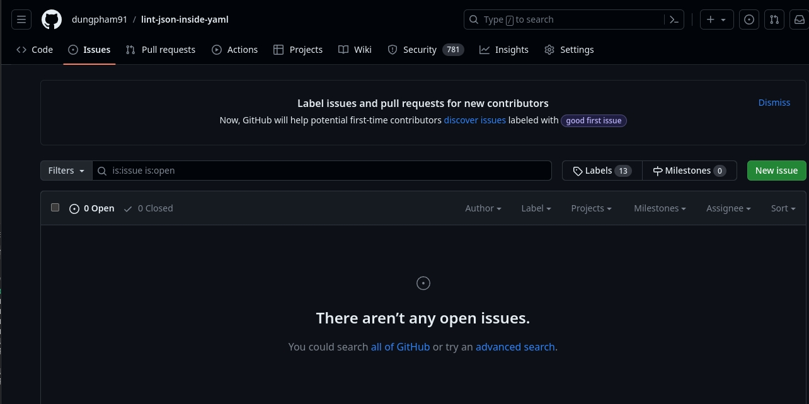
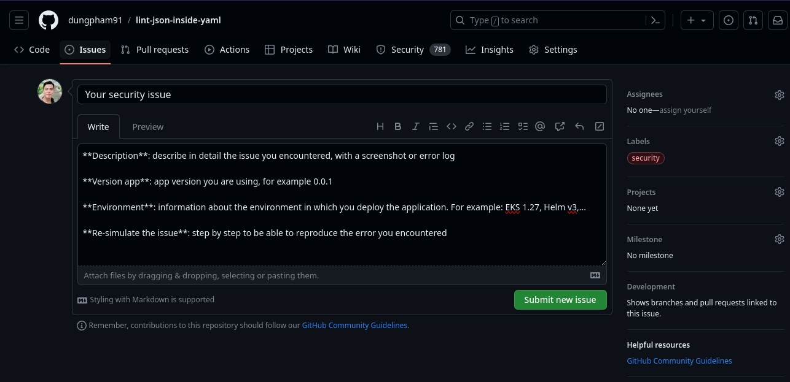

# Security Policy

## Supported Versions

Below is a list of versions that will be supported with security issues.

| Version | Supported          |
| ------- | ------------------ |
| v0.0.1 (Current) | ✔️ |

## Reporting a Vulnerability

First, we would like to inform all of you that we are also proactive in checking the security of the application, through the following support tools:
- [CodeQL](https://github.com/github/codeql-action): discover vulnerabilities in codebase.
- [Dependency Review](https://github.com/actions/dependency-review-action): scans pull requests for dependency changes, and will raise an error if any vulnerabilities or invalid licenses are being introduced.
- [DevSkim](https://github.com/microsoft/DevSkim-Action): security linter that highlights common security issues in source code.
- [Haskell Docker Linter](https://github.com/hadolint/hadolint-action): Dockerfile linter that helps to build best practice Docker images.
- [Scorecard Supply-chain Security](https://github.com/ossf/scorecard-action): Scorecard checks for vulnerabilities affecting different parts of the software supply chain including source code, build, dependencies, testing, and project maintenance.
- [Trivy Docker Image Scanning](https://github.com/aquasecurity/trivy-action): scan Docker container image for vulnerabilities.

However, during development, things can become outdated or new vulnerabilities appear quickly that we may not detect in time.

In that case, if you find any problems related to the security of the application. Please contact us by following steps:
- Click the [Issues](https://github.com/dungpham91/lint-json-inside-yaml/issues) item and then click the `New issue` button to create a new issue for the security issue you discovered.

- Next, please fill in the necessary information for the issue as shown in the image below. Be sure to select the `security` label. And at the same time provide all the basic information below:

  - **`Description`**: describe in detail the issue you encountered, with a screenshot or error log.

  - **`Version app`**: app version you are using, for example 0.0.1

  - **`Environment`**: information about the environment in which you deploy the application. For example: EKS 1.27, Helm v3,...

  - **`Re-simulate the issue`**: step by step to be able to reproduce the error you encountered

 
## Security fix time

Because it is a personal development project and is not sponsored by any source. So how long it takes to fix a security bug depends on my personal work schedule.

However, security issues are always my first priority to fix if I receive a report. At this point, I can `temporarily commit to 2 weeks` for fixing a security bug.

But you must also be aware that the 2 week period may also change in the future. It is not completely fixed.
